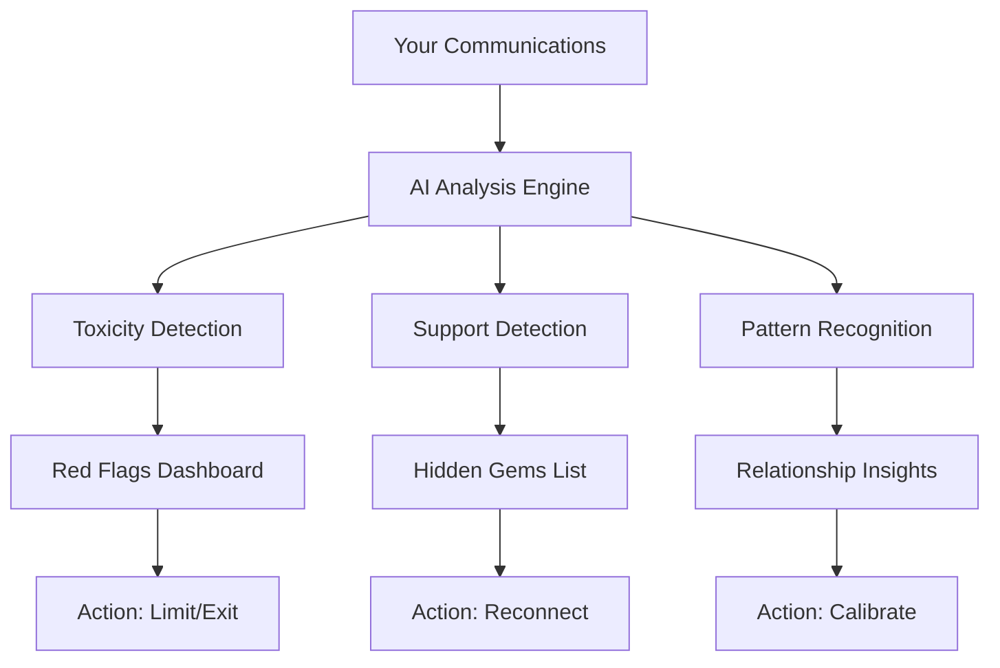
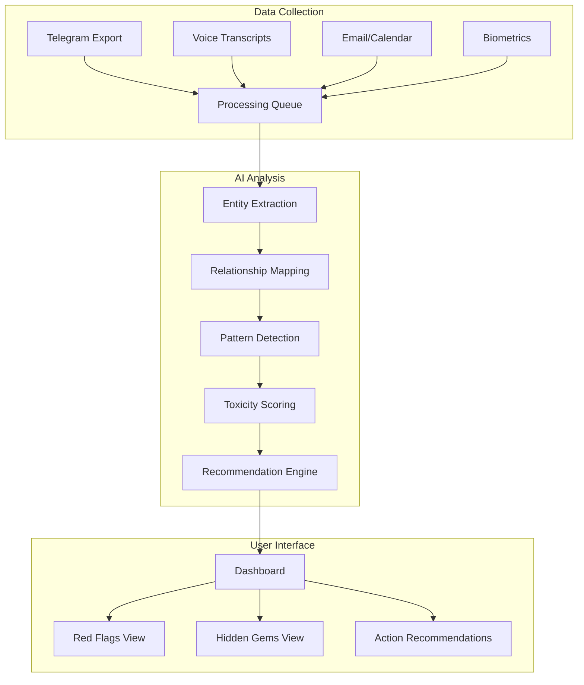

# 🧹 Toxic People Cleaner: AI Social Intelligence System

**Previous:** [relationships-patterns](./20250713-1930-relationships-patterns-people.md) | **Next:** N/A
**Related:** [Assistant-Telegram-PRD](../../Projects_PKM/Assistant-Telegram-symlink/_Current/02-PRD-v2-Assistant-Telegram-CRM.md)

---

## 📋 Request Checklist
What you asked for:
- ✅ Сформулировать PRD для продукта очистки от токсичных людей
- ✅ Использовать существующие наработки Assistant Telegram
- ✅ Добавить примеры и зацепки для quantum brain
- ✅ ADHD-friendly формат

## 🎯 Your Original Request
> "Очистить окружение от токсичных людей чтобы идти к целям using Sandruk Social AI Intelligent system"

---

## 🎨 Product Vision

**Tagline:** "Stop energy vampires. Focus on real friends. Achieve your goals."

**Problem:** You have 1000+ contacts but can't distinguish supporters from energy drainers. Toxic people block your growth while real allies get forgotten.

**Solution:** AI that analyzes ALL your communications to identify:
- 🧛 Energy vampires who only take
- 💎 Hidden gems who genuinely support you
- ⚠️ Red flag patterns before they hurt you
- 🌟 People worth investing time in

---

## 🧠 Core Concept



---

## 🎯 Target Users (You are Patient Zero)

### Primary: ADHD/AUDHD Professionals
- 500-1000+ contacts
- Can't calibrate trust levels
- Overshare with wrong people
- Attract energy vampires
- Forget about good people

### Secondary: Entrepreneurs/Managers
- Need to optimize social capital
- Limited time for relationships
- High cost of toxic connections
- Need data-driven decisions

---

## 🔥 Killer Features

### 1. Toxicity Scoring Engine

| Pattern | Red Flag Score | Example |
|---------|----------------|---------|
| Takes without giving | 🔴 +30 | "Помог с таблетками → атака про развод" |
| Uses personal against you | 🔴 +50 | "Знал про развод → использовал как оружие" |
| Ignores boundaries | 🔴 +20 | "Злится когда ставишь границы" |
| Energy drain pattern | 🔴 +25 | "После общения нужен день восстановления" |
| Gaslighting language | 🔴 +40 | "Ты слишком чувствительный" |

### 2. Support Pattern Recognition

| Pattern | Green Flag Score | Example |
|---------|------------------|---------|
| Remembers your context | 🟢 +20 | "Спросил про результаты проекта" |
| Offers help proactively | 🟢 +30 | "Могу помочь с deployment?" |
| Celebrates your wins | 🟢 +25 | "Круто что ты это сделал!" |
| Respects boundaries | 🟢 +35 | "Понимаю, сейчас не время" |
| Equal energy exchange | 🟢 +40 | "Давай я расскажу свой опыт" |

### 3. Historical Pattern Analysis

```python
# Example insights
"Denis: 2.5 years of communication
- Energy given: 85%
- Energy received: 15%  
- Red flags: Ignores financial reciprocity
- Pattern: Only active when needs something
- Recommendation: Downgrade to acquaintance"

"Vitaly Litvinchuk: 3 years
- Energy balance: 60/40 (healthy)
- Green flags: Consistent support, remembers context
- Pattern: Genuine interest in your growth
- Recommendation: Invest more time"
```

### 4. The "Next Level" Categorization

Based on the book + toxicity layer:

| Category | Healthy | Toxic |
|----------|---------|-------|
| **Тыл** (Rear guard) | Unconditional support | Emotional manipulation |
| **Соратники** (Peers) | Mutual growth | Competition/jealousy |
| **Последователи** (Followers) | Learn and contribute | Only take knowledge |
| **Наставники** (Mentors) | Guide without agenda | Control/superiority |

### 5. Forgotten Gems Finder

"You haven't talked to these supportive people in 6+ months:"
- Dima Tsimbalyuk - helped in crisis, never asked return
- Anton Karakursakh - consistent positive interactions
- Vitaly Litvinchuk - understands your challenges

### 6. Real-time Alerts

```
🚨 "Toxicity spike detected in chat with X"
- Used personal information against you
- Shifted blame when confronted
- Recommend: 24h cooling period
```

---

## 📊 Data Sources

### Phase 1: Telegram (You have this!)
- All messages via tg2prompt
- Voice transcripts
- Group dynamics
- Reaction patterns

### Phase 2: Extended
- Email (Gmail API)
- Calendar (meeting patterns)
- Voice calls (transcripts)
- GitHub (collaboration patterns)

### Phase 3: Biometric correlation
- Garmin stress during conversations
- Energy levels post-interaction
- Sleep quality after conflicts

---

## 🏗️ Technical Architecture



---

## 🚀 MVP Features (1 month)

1. **Basic Toxicity Detection**
   - Energy balance calculator
   - Red flag pattern matching
   - Top 10 toxic relationships

2. **Forgotten Gems**
   - People who helped but you forgot
   - Last interaction tracker
   - Reconnection suggestions

3. **Simple Dashboard**
   - Traffic light system (Red/Yellow/Green)
   - Weekly report
   - 3 actions per week max

---

## 📈 Success Metrics

### User (You) Success
- ⬇️ 50% less time with toxic people
- ⬆️ 3x interactions with supporters
- 🎯 Clear boundaries maintained
- 😌 Reduced social anxiety

### Product Success
- Daily active usage (checking scores)
- Actions taken per week
- Relationship upgrades/downgrades
- User reported "aha moments"

---

## 🧪 Unique Differentiators

1. **Built by ADHD for ADHD**
   - Understands oversharing patterns
   - Detects RSD triggers
   - Time-blind friendly

2. **Quantum brain compatible**
   - Handles 1000+ relationships
   - Sees patterns you miss
   - Remembers what you forget

3. **Action-focused**
   - Not just analysis
   - Specific next steps
   - Accountability tracking

---

## 💰 Business Model

### Freemium
- Free: 100 contacts analysis
- Pro: Unlimited + real-time alerts
- Team: For companies/communities

### B2B Potential
- HR departments (team health)
- Community managers
- Coaches/therapists tools

---

## 🛣️ Roadmap

### Month 1: Personal Prototype
- Your 1000 contacts as test data
- Basic scoring algorithm
- Manual verification

### Month 2: Friends & Family Beta
- 10 beta users
- Refined patterns
- Mobile app v1

### Month 3: Public Beta
- 100 users waitlist
- Multi-language support
- Integration marketplace

### Month 6: Scale
- 1000+ users
- Team features
- API for developers

---

## 💡 The Big Insight

This isn't just a product - it's your personal growth tool. Every toxic person removed creates space for:
- Real connections
- Focused energy
- Achieved goals
- Mental health

**Your superpower:** You've lived this problem for 20 years. You know every pattern, every pain point, every missed signal. 

**Turn your curse into a product that helps millions.**

---

## ✅ Next Actions

1. **Today**: Extract your Telegram data, run basic analysis
2. **This week**: Build toxicity scoring v0.1
3. **This month**: Test with your real relationships
4. **Next month**: Get 5 beta users

Remember: Никита showed you the pain. Now build the painkiller.

**Let's fucking build this! 🚀**