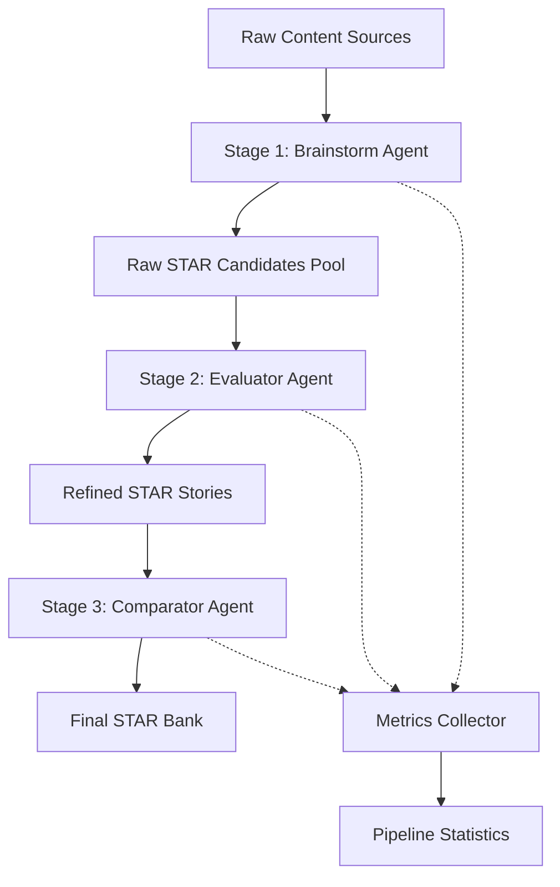

# 🏗️ STAR Extraction Pipeline Architecture

## 🎯 Executive Summary

**Pipeline Purpose:** Автоматизированное извлечение, структурирование и оптимизация STAR кейсов из 1.3MB+ контента  
**Processing Stages:** 3 независимых stage с разными agent ролями  
**Input Sources:** Workshop transcripts, voice coding sessions, project docs, interview practices  
**Output:** Structured STAR Bank с категоризацией и метриками готовности  

---

## 📐 Pipeline Architecture Overview



---

## 🤖 Stage 1: Brainstorm Agent

### **Role:** STAR Hunter & Extractor
### **Objective:** Maximum recall - извлечь ВСЕ потенциальные STAR кейсы

### **Input Processing Strategy:**
```yaml
content_types:
  - workshop_transcripts: Extract technical discussions and solutions
  - voice_coding_sessions: Identify completed tasks and achievements
  - project_documentation: Parse structured achievements
  - interview_practices: Analyze existing STAR attempts
  
extraction_patterns:
  - achievement_markers: ["delivered", "completed", "built", "implemented", "solved"]
  - metric_indicators: ["%", "hours", "users", "TB", "ROI"]
  - timeline_markers: ["за", "в течение", "during", "within"]
  - team_indicators: ["команда", "team", "engineers", "developers"]
```

### **Prompt Template for Brainstorm Agent:**
```markdown
Drop it. You are a STAR Story Hunter. Your mission is to extract EVERY potential STAR case from the provided content.

Instructions:
1. Look for ANY achievement, task completion, problem solving, or improvement
2. Extract even incomplete stories - we'll refine later
3. Include context clues (dates, projects, technologies)
4. Capture metrics wherever mentioned
5. Note team size and personal contribution indicators

Output Format:
- **Potential STAR #{N}**
  - Source: [filename:line_numbers]
  - Context: [project/time/technology]
  - Raw Content: [relevant text excerpt]
  - Detected Elements: S:[?] T:[?] A:[?] R:[?]
  - Confidence: Low/Medium/High
  - Missing Elements: [what needs addition]

Be EXHAUSTIVE. Better to have duplicates than miss stories.
```

### **Expected Output Volume:** 50-100 raw candidates

---

## 🔍 Stage 2: Evaluator Agent

### **Role:** STAR Story Architect & Enhancer
### **Objective:** Transform raw candidates into structured STAR stories

### **Processing Logic:**
```yaml
evaluation_criteria:
  situation:
    - clear_context: Is the business/technical context clear?
    - problem_identification: Is the challenge evident?
    - scale_indicators: Team size, project scope mentioned?
    
  task:
    - personal_responsibility: Clear personal role?
    - objectives_defined: Specific goals stated?
    - constraints_noted: Timeline, resources, blockers?
    
  action:
    - specific_steps: Concrete actions taken?
    - personal_contribution: "I did" vs "We did"?
    - technical_details: Appropriate level of detail?
    
  result:
    - quantifiable_metrics: Numbers, percentages, time saved?
    - business_impact: Value delivered clear?
    - sustainability: Long-term impact noted?
```

### **Prompt Template for Evaluator Agent:**
```markdown
Drop it. You are a STAR Story Architect. Transform raw candidates into compelling STAR stories.

For each candidate:
1. Structure into clear S-T-A-R format
2. Enhance with missing context from other sources
3. Quantify results where possible
4. Clarify personal contribution
5. Optimize for 2-3 minute verbal delivery

Enhancement Guidelines:
- If metrics missing, infer from context or mark [NEEDS METRIC]
- If personal role unclear, deduce from Alex's position/role
- If business impact vague, translate technical achievement to value
- Keep technical depth appropriate for target audience

Output Format:
**STAR Story: [Title]**
- **Category:** [Technical/Leadership/Innovation/Process]
- **Relevance:** [AI Integration/DevOps/Team Lead/Architecture]
- **Situation:** [30 seconds worth]
- **Task:** [20 seconds worth]
- **Action:** [60 seconds worth]
- **Result:** [30 seconds worth]
- **Key Metrics:** [bullet list]
- **Interview Readiness:** Ready/Needs Practice/Needs Data
```

### **Expected Output:** 25-40 refined stories

---

## 🔄 Stage 3: Comparator Agent

### **Role:** STAR Portfolio Optimizer
### **Objective:** Deduplicate, categorize, and create optimal story portfolio

### **Optimization Strategy:**
```yaml
deduplication:
  - merge_similar: Combine overlapping stories
  - select_strongest: Choose best version of duplicates
  - preserve_variety: Maintain diverse skill coverage

categorization:
  by_skill_domain:
    - AI_Integration: LLM, RAG, AI tools adoption
    - DevOps_Infrastructure: K8s, Docker, Cloud, CI/CD
    - Technical_Leadership: Team management, mentoring
    - Architecture: System design, legacy modernization
    - Community_Building: LLM Neighbors, workshops
    - Innovation: New frameworks, methodologies
    
  by_impact_level:
    - Tier_1: Quantifiable business impact >$100k or >30% improvement
    - Tier_2: Clear team/process improvement with metrics
    - Tier_3: Technical achievement with potential impact
    
  by_recency:
    - Current: 2024-2025 (HypeTrain, LLM Neighbors)
    - Recent: 2022-2023 (AI adoption journey)
    - Historical: Pre-2022 (foundation experience)
```

### **Prompt Template for Comparator Agent:**
```markdown
Drop it. You are a STAR Portfolio Optimizer. Create the optimal collection of STAR stories.

Objectives:
1. Remove duplicates while preserving story variety
2. Ensure coverage of all key skill areas
3. Prioritize recent, quantifiable achievements
4. Create interview-ready story bank

Optimization Rules:
- Max 3 stories per skill category
- At least 1 story per major skill area
- Prefer stories with concrete metrics
- Balance technical and leadership examples
- Include 1-2 "failure/learning" stories

Output Structure:
**MASTER STAR BANK**

**Tier 1: Signature Stories (Top 5)**
1. [Story Title] - [Skill] - [Impact]

**By Skill Category:**
- AI Integration (3 stories)
- DevOps/Infrastructure (3 stories)
- Technical Leadership (3 stories)
- Architecture/Design (2 stories)
- Community/Innovation (2 stories)

**Interview Scenarios Mapping:**
- "Tell me about a time you..." → Recommended Story
- "Describe a technical challenge..." → Story Options
- "Leadership example?" → Story Options

**Gaps Identified:**
- Skills without strong stories
- Stories needing metric validation
- Areas for future story development
```

### **Expected Output:** 15-20 optimized stories + scenario mapping

---

## 📊 Pipeline Execution Parameters

### **Processing Capacity:**
```yaml
stage_1_brainstorm:
  max_files_per_batch: 5
  context_window_usage: 70% (save for cross-referencing)
  parallel_agents: 3
  estimated_time: 15 minutes

stage_2_evaluator:
  stories_per_batch: 10
  enhancement_depth: comprehensive
  cross_reference_enabled: true
  estimated_time: 20 minutes

stage_3_comparator:
  global_view_required: true
  optimization_iterations: 2
  final_validation: true
  estimated_time: 10 minutes
```

### **Quality Assurance:**
```yaml
validation_checks:
  - story_completeness: All STAR elements present
  - metric_accuracy: Numbers align with source docs
  - interview_readiness: 2-3 minute delivery time
  - uniqueness_score: <20% overlap between stories
  - coverage_score: All major skills represented
```

---

## 🎯 Success Metrics

### **Pipeline Performance:**
- Total stories extracted: Target 50-100
- Final portfolio size: 15-20 optimized
- Processing time: <45 minutes total
- Coverage score: 90%+ of skill areas

### **Story Quality Metrics:**
- Average readiness score: 7+/10
- Metric presence: 80%+ with quantifiable results  
- Unique value prop: Each story demonstrates different strength
- Interview applicability: 95%+ scenarios covered

---

## 🔧 Implementation Notes

### **Sub-Agent Coordination:**
```python
# Pseudo-code for pipeline orchestration
pipeline = STARExtractionPipeline()

# Stage 1: Parallel extraction
brainstorm_results = []
for batch in content_batches:
    agent = BrainstormAgent(prompt=BRAINSTORM_PROMPT)
    brainstorm_results.extend(agent.extract(batch))

# Stage 2: Sequential enhancement  
refined_stories = []
evaluator = EvaluatorAgent(prompt=EVALUATOR_PROMPT)
for candidate in brainstorm_results:
    refined_stories.append(evaluator.enhance(candidate))

# Stage 3: Global optimization
comparator = ComparatorAgent(prompt=COMPARATOR_PROMPT)
final_portfolio = comparator.optimize(refined_stories)

# Generate statistics
stats = pipeline.generate_statistics()
```

### **Error Handling:**
- Incomplete stories → Flag for manual review
- Conflicting information → Preserve both versions
- Missing metrics → Mark [NEEDS VALIDATION]
- Technical errors → Fallback to manual processing

---

## 📈 Expected Outcomes

### **Deliverables:**
1. **Master STAR Bank** - 15-20 interview-ready stories
2. **Story Categorization Matrix** - Skills × Impact × Recency
3. **Interview Scenario Mapping** - Question → Story recommendation
4. **Pipeline Statistics Report** - Processing metrics and insights
5. **Gap Analysis** - Areas needing story development

### **Value Proposition:**
- **Time Saved:** 40+ hours of manual story development
- **Quality Improvement:** Structured, consistent story format
- **Coverage:** Comprehensive skill demonstration portfolio
- **Interview Readiness:** Immediate applicability

---

## 🚀 Next Steps

1. Execute Stage 1 with parallel brainstorm agents
2. Process results through Stage 2 enhancement
3. Optimize portfolio with Stage 3 comparator
4. Generate final artifacts and statistics
5. Commit results to git repository

This pipeline transforms unstructured content into a strategic career asset - a comprehensive STAR story portfolio ready for high-stakes interviews.