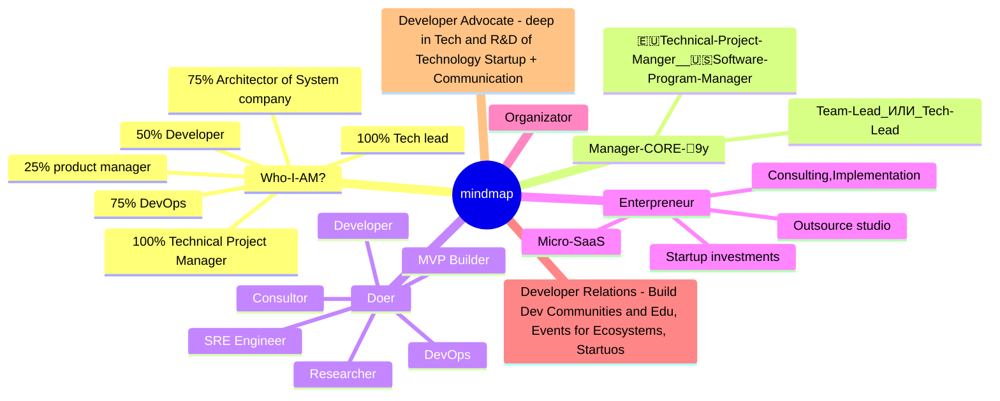

# 2025-05-23
1. Tech-Lead 90%
2. Doer 75%
3. Researcher 65%
4. Enterpreneur 20%
5. Organizator 50%

# 2024-10-15

| Критерий                     | План А. Карьерная цель                                                                                                                                                                                                                                                                                                          | План Б. Шаг к цели                                                                                                                                                           | План Г. На крайний случай                                                                                                                                          |
| ---------------------------- | ------------------------------------------------------------------------------------------------------------------------------------------------------------------------------------------------------------------------------------------------------------------------------------------------------------------------------- | ---------------------------------------------------------------------------------------------------------------------------------------------------------------------------- | ------------------------------------------------------------------------------------------------------------------------------------------------------------------ |
| **Дедлайн на поиск работы:** | 6 месяцев                                                                                                                                                                                                                                                                                                                       | 9 месяцев                                                                                                                                                                    | 12 месяцев                                                                                                                                                         |
| **Компания**                 |                                                                                                                                                                                                                                                                                                                                 |                                                                                                                                                                              |                                                                                                                                                                    |
| Размер                       | 200+                                                                                                                                                                                                                                                                                                                            | 50-200                                                                                                                                                                       | 5-50                                                                                                                                                               |
| Отрасль                      | AI/ML, Web3/Crypto, FinTech                                                                                                                                                                                                                                                                                                     | EdTech, Big Data, Blockchain                                                                                                                                                 | Tech-oriented E-commerce, SaaS                                                                                                                                     |
| Локация компании             | US, Remote-first                                                                                                                                                                                                                                                                                                                | EU, UK, Remote-friendly                                                                                                                                                      | Global Remote                                                                                                                                                      |
| Этап развития                | Scale-up, Late-stage startup                                                                                                                                                                                                                                                                                                    | Early-stage startup, Launch                                                                                                                                                  | Established SME, Start-up                                                                                                                                          |
| Руководитель                 | C-level executive, Visionary tech leader                                                                                                                                                                                                                                                                                        | Senior leadership                                                                                                                                                            | Team lead or middle management                                                                                                                                     |
| Команда                      | High-performing, diverse, innovation-driven                                                                                                                                                                                                                                                                                     | Motivated, growing, open to new ideas                                                                                                                                        | Small but dedicated                                                                                                                                                |
| Перспективы                  | Rapid growth, industry leader, cutting-edge tech                                                                                                                                                                                                                                                                                | Innovative product, market potential                                                                                                                                         | Stable with room for optimization                                                                                                                                  |
| **Моя роль**                 |                                                                                                                                                                                                                                                                                                                                 |                                                                                                                                                                              |                                                                                                                                                                    |
| Должность                    | CTO, CIO (Chief Innovation Officer), Head of Developer Relations, Head of AI/Blockchain Research                                                                                                                                                                                                                                | Head of Engineering, Lead Architect, Senior DevRel Engineer, Principal Engineer (AI/Blockchain)                                                                              | Senior Developer, Tech Lead, DevRel Engineer, AI/Blockchain Specialist                                                                                             |
| Грейд                        | Executive                                                                                                                                                                                                                                                                                                                       | Senior Leadership                                                                                                                                                            | Senior Individual Contributor                                                                                                                                      |
| Хардовые задачи              | • Implementing cutting-edge AI/ML solutions • Building and leading developer communities • Organizing major tech conferences and hackathons • Strategic tech evangelism and advocacy • Blockchain integration and research • Designing scalable fintech systems                                                  | • Architecting scalable AI/Blockchain systems • Leading tech community initiatives • Technical content creation and workshops • Optimizing ML/DLT pipelines         | • Developing AI/Blockchain applications • Local community management • Technical documentation • Performance optimization                                 |
| Хардовые задачи              | • Создание и развитие глобальных технических сообществ  • Разработка стратегии развития DevRel направления  • Организация международных хакатонов и конференций  • Интеграция AI/Blockchain инноваций  • Развитие кросс-культурных технических коммьюнити  • Создание образовательных программ для разработчиков |   • Ведение региональных технических сообществ  • Организация воркшопов и митапов  • Создание обучающих материалов  • Развитие локальных DevRel инициатив        | • Поддержка существующих коммьюнити  • Участие в технических мероприятиях  • Создание контента для разработчиков                                             |
| Конкретные продукты          | • AI-driven financial platforms • Developer community platforms • Technical education programs • Decentralized autonomous systems • Next-gen AI assistants • Advanced trading systems                                                                                                                            | • Web3 infrastructure • Developer advocacy programs • AI-enhanced productivity tools • Large-scale data processing systems • Blockchain-based identity solutions | • E-commerce recommendation engines • Developer documentation portals • Business intelligence solutions • AI-powered automation tools • Crypto wallets |
| Конкретные продукты          | • Международная платформа для технических сообществ  • Образовательные программы по AI/Blockchain  • Система менторства для разработчиков  • Инновационные форматы технических мероприятий                                                                                                                             | • Региональные технические хабы  • Программы обмена опытом  • Платформы для коллаборации разработчиков                                                                 | • Локальные технические группы  • Документация и туториалы  • Базы знаний для разработчиков                                                                  |
| **Условия работы**           | Крупные страны -40%                                                                                                                                                                                                                                                                                                             |                                                                                                                                                                              |                                                                                                                                                                    |
| Зарплата: минимум, оптимум   | 180K - 250K+                                                                                                                                                                                                                                                                                                                    | 120K - 180K                                                                                                                                                                  | 80K - 120K                                                                                                                                                         |
| Удаленка, гибрид, офис       | Remote-first with occasional travel for key meetings                                                                                                                                                                                                                                                                            | Hybrid or remote with quarterly on-site weeks                                                                                                                                | Fully remote                                                                                                                                                       |
| **Если работа не в России:** |                                                                                                                                                                                                                                                                                                                                 |                                                                                                                                                                              |                                                                                                                                                                    |
| Какая страна                 | NE, FR, ES, UK?, Switzerland                                                                                                                                                                                                                                                                                                    | US, Canada, Switzerland, EU countries, UK, Australia                                                                                                                         | Any country with good internet and quality of life                                                                                                                 |
| Условия по релокейту         | Full relocation package, long-term visa support                                                                                                                                                                                                                                                                                 | Partial relocation assistance, help with work permits                                                                                                                        | Remote work with occasional travel                                                                                                                                 |
| **Развитие навыков**         | Advanced AI/ML, Quantum computing, Ethical AI, DeFi innovations                                                                                                                                                                                                                                                                 | Blockchain scalability, Edge computing, AI hardware optimization, Zero-knowledge proofs                                                                                      | Cloud optimization, Agile methodologies, Full-stack AI/Blockchain development                                                                                      |
| **Нетворкинг**               | Speaking at major tech conferences, Contributing to AI/Blockchain research papers                                                                                                                                                                                                                                               | Active in online tech communities, Hosting webinars on AI/Blockchain topics                                                                                                  | Local tech meetups, online forums, Open-source contributions                                                                                                       |
| **Метрики успеха**           | Company valuation increase, Patents filed, AI/Blockchain breakthroughs                                                                                                                                                                                                                                                          | User growth, Technical milestones achieved, AI/Blockchain model performance improvements                                                                                     | Code quality metrics, Team productivity, Successful AI/Blockchain project deployments                                                                              |

## План действий

1. Создать персональный бренд как инноватора и community builder:
   - Начать технический блог о передовых технологиях и построении сообществ
   - Участвовать в конференциях как спикер по темам AI, Blockchain и DevRel
   - Развивать существующие технические сообщества и создавать новые
   - Публиковать исследования и мысли о будущем технологий на LinkedIn

2. Углубить экспертизу в ключевых областях:
   - Изучить лучшие практики Developer Relations и Community Management
   - Пройти курсы по публичным выступлениям и организации технических мероприятий
   - Развивать навыки технического писательства и создания обучающих материалов
   - Продолжать исследования в области AI, blockchain и квантовых вычислений

3. Расширить профессиональную сеть:
   - Присоединиться к элитным AI и Blockchain сообществам и форумам
   - Установить контакты с лидерами мнений в AI и Blockchain индустриях
   - Участвовать в хакатонах по AI и блокчейну

4. Оптимизировать процесс поиска работы:
   - Создать систему для быстрого анализа и отклика на релевантные вакансии
   - Разработать методику для эффективной подготовки к техническим интервью по AI и Blockchain
   - Подготовить портфолио проектов, демонстрирующее глубину экспертизы в обеих областях

5. Развить навыки презентации сложных технических концепций:
   - Практиковать объяснение AI и Blockchain концепций нетехническим специалистам
   - Создать серию видео-туториалов по продвинутым темам в AI и Blockchain

6. Поддерживать баланс и продуктивность:
   - Внедрить систему тайм-боксинга для глубоких исследований
   - Регулярно практиковать техники осознанности для управления ADHD-симптомами
   - Создать структурированную систему для организации и быстрого доступа к накопленным знаниям

## Триггеры для переключения между планами

1. План А → План Б:
   - Отсутствие подходящих вакансий топ-уровня в AI/Blockchain в течение 4 месяцев
   - Изменение рыночных условий, влияющее на финансирование AI/Blockchain проектов

2. План Б → План Г:
   - Трудности с получением визы или разрешения на работу в целевых странах
   - Необходимость в большей стабильности из-за личных обстоятельств

3. План Г → План Б или А:
   - Значительное улучшение портфолио AI/Blockchain проектов
   - Публикация влиятельной статьи или исследования в области AI или Blockchain
   - Создание успешного AI/Blockchain стартапа или продукта
